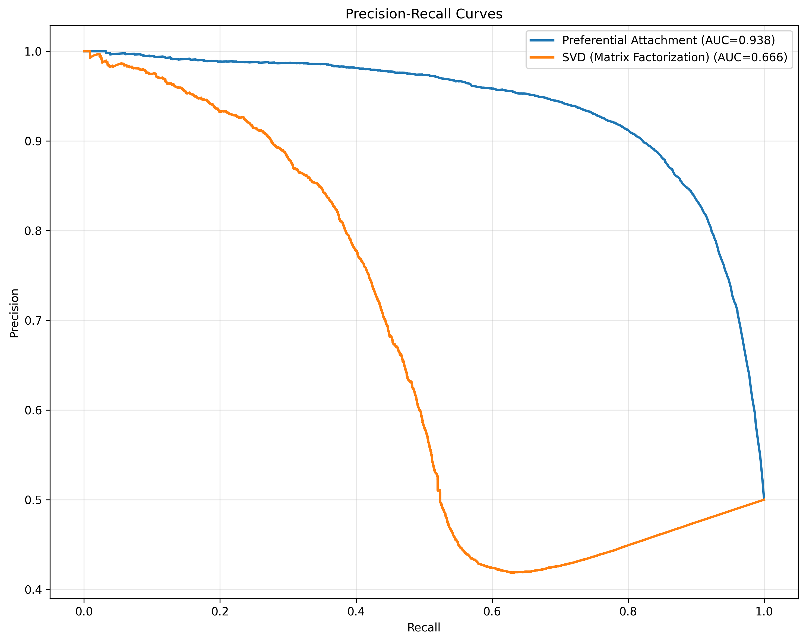
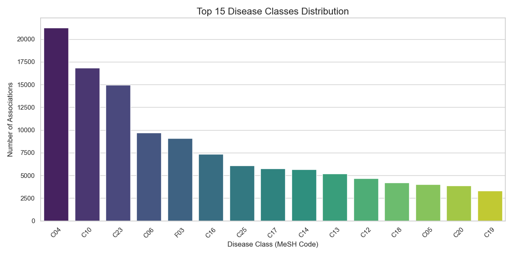
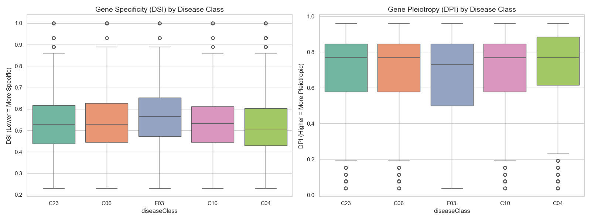
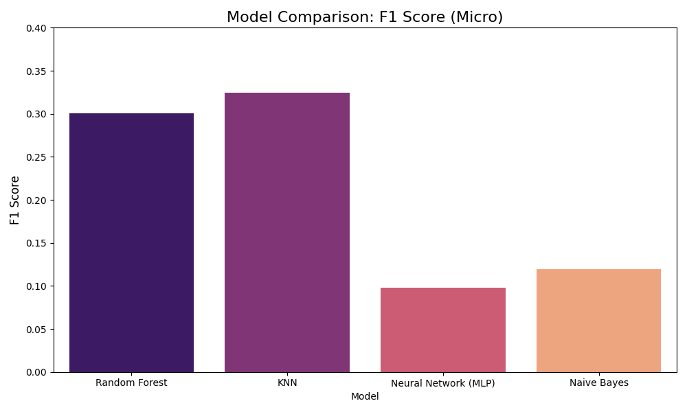
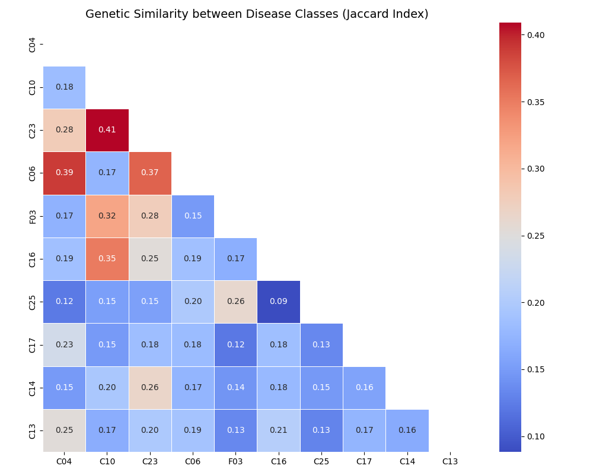

# Gene-Disease Association Analysis and Prediction: A Network-Based Approach

**GitHub Repository**: [https://github.com/pelapi/5523-group20](https://github.com/pelapi/5523-group20)

---

## 1. Introduction

### 1.1 Background and Problem Statement
The elucidation of gene-disease associations (GDAs) is a fundamental challenge in modern biomedical research, serving as the bedrock for precision medicine, drug target discovery, and the understanding of disease etiology. Traditionally, the identification of these associations has relied on time-consuming and expensive "wet-lab" experiments, such as genome-wide association studies (GWAS) and linkage analysis. While these methods have been successful, they are often limited by sample size, statistical power, and the sheer complexity of the human interactome.

As a result, computational methods for predicting GDAs have emerged as a critical complement to experimental approaches. By prioritizing candidate genes for specific diseases, computational models can significantly reduce the search space and accelerate the discovery process. However, a major limitation of current state-of-the-art approaches—particularly those based on deep learning and graph embeddings—is their lack of **interpretability**. These "black box" models may achieve high predictive accuracy, but they often fail to explain *why* a gene is predicted to be associated with a disease. In clinical settings, understanding the biological rationale behind a prediction is often as important as the prediction itself.

### 1.2 Motivation: The Need for Interpretability
This project is motivated by the hypothesis that the topological properties of a gene within the global gene-disease network contain intrinsic biological signals that can be used to predict its disease associations. Specifically, we posit that "generalist" genes (those involved in many processes) and "specialist" genes (those specific to a single pathway) exhibit distinct structural signatures.

By focusing on interpretable network indices—such as **Disease Specificity Index (DSI)** and **Disease Pleiotropy Index (DPI)**—rather than opaque embedding vectors, we aim to build a predictive model that is transparent and biologically meaningful. We seek to answer not just "Which disease does this gene cause?" but "What characteristics of this gene make it a candidate for this disease?"

### 1.3 Objectives and Scope
This study adopts a comprehensive, two-phase computational approach:
1.  **Phase 1: Network Topology Validation**: Before performing any classification, we first validate the structural integrity of the gene-disease network. We test the "Rich-get-Richer" hypothesis using link prediction algorithms to confirm that the network exhibits a scale-free topology suitable for feature extraction.
2.  **Phase 2: Feature-Based Classification**: We leverage the insights from Phase 1 to construct a machine learning pipeline. We evaluate multiple algorithms (KNN, Random Forest, Naive Bayes, MLP) to predict the primary disease category of a gene based solely on its topological features.

Our work emphasizes **scientific rigor** over pure performance metrics. We explicitly analyze **negative results** (e.g., the failure of deep learning on this task) and discuss the limitations imposed by data bias and class imbalance.

---

## 2. Methods

### 2.1 Data Source and Preprocessing
We utilized the **DisGeNET** database (v7.0), one of the largest publicly available collections of genes and variants associated with human diseases. DisGeNET integrates data from expert-curated repositories, GWAS catalogs, animal models, and the scientific literature.

*   **Raw Data**: The initial dataset contained over 80,000 gene-disease associations.
*   **Quality Control**: To ensure the reliability of our network, we filtered for associations with a confidence `score > 0.3`. This threshold removes tenuous associations based on limited text-mining evidence, retaining only those with stronger experimental or curated support.
*   **Class Filtering**: The raw data covers thousands of specific disease phenotypes. To formulate a tractable machine learning problem, we mapped diseases to their high-level **MeSH (Medical Subject Headings)** categories. We selected the Top 20 disease classes by frequency, resulting in a final dataset of approximately **70,000 records** spanning diverse categories such as Neoplasms, Nervous System Diseases, and Cardiovascular Diseases.
*   **Graph Construction**: We modeled the data as a bipartite graph $G = (U, V, E)$, where $U$ is the set of Genes, $V$ is the set of Diseases, and an edge $e_{uv} \in E$ exists if gene $u$ is associated with disease $v$.

### 2.2 Phase 1: Network Validation Algorithms
To validate the topological hypothesis, we employed two distinct link prediction algorithms as baselines.

#### 2.2.1 Preferential Attachment (PA)
The Preferential Attachment model is based on the theory that "hubs" (highly connected nodes) are more likely to acquire new links. In the context of a bipartite network, the probability of a link between gene $u$ and disease $v$ is proportional to the product of their degrees:
$$ Score(u, v) = |N(u)| \times |N(v)| $$
where $N(u)$ is the set of neighbors of node $u$. A high performance of PA indicates that the network is **scale-free** and driven by a "Rich-get-Richer" mechanism.

#### 2.2.2 SVD Matrix Factorization
As a contrast to the heuristic PA method, we applied Singular Value Decomposition (SVD) to the adjacency matrix $A$. SVD decomposes the matrix into latent factors:
$$ A \approx U \Sigma V^T $$
This method assumes that the network structure is determined by low-rank latent variables. It serves as a baseline for embedding-based approaches.

### 2.3 Phase 2: Feature Engineering
Instead of using high-dimensional graph embeddings (like Node2Vec) which are difficult to interpret, we engineered a compact set of biologically relevant features:

1.  **Disease Specificity Index (DSI)**:
    $$ DSI = \log_2 \left( \frac{N_{diseases}}{N_{total}} \right) $$
    This metric quantifies how specific a gene is. A low DSI indicates a "generalist" gene associated with many diverse diseases, while a high DSI indicates a "specialist."

2.  **Disease Pleiotropy Index (DPI)**:
    This metric measures the diversity of the disease classes associated with a gene. It is calculated based on the entropy of the distribution of disease classes. A high DPI suggests the gene is involved in multiple distinct biological systems (e.g., a gene affecting both the brain and the heart).

3.  **Association Score**: The cumulative evidence score from DisGeNET, reflecting the strength of the association.

4.  **Degree Centrality**: The raw number of connections, serving as a proxy for the gene's importance in the network.

### 2.4 Phase 3: Classification Models
We formulated the problem as a multi-class classification task: *Predict the primary MeSH disease class for a gene given its feature vector.* We selected four algorithms to test different inductive biases:

1.  **K-Nearest Neighbors (KNN)**:
    *   *Rationale*: Tests the "Guilt-by-Association" hypothesis—that genes close in feature space share similar functions.
    *   *Settings*: $k=5$, Euclidean distance.
2.  **Random Forest (RF)**:
    *   *Rationale*: Tests the ability to capture non-linear relationships and feature interactions without assuming a specific data distribution.
    *   *Settings*: 100 trees, Gini impurity criterion, `class_weight='balanced'` to handle imbalance.
3.  **Naive Bayes (NB)**:
    *   *Rationale*: Tests the assumption of feature independence. This serves as a baseline to check if correlations between DSI and DPI matter.
    *   *Settings*: Gaussian distribution assumption.
4.  **Multi-Layer Perceptron (MLP)**:
    *   *Rationale*: Tests if a deep neural network can extract complex latent patterns from the low-dimensional features.
    *   *Settings*: 2 hidden layers (64, 32 units), ReLU activation, Adam optimizer.

---

## 3. Results

### 3.1 Phase 1: Network Topology Validation
The results of the link prediction experiments were decisive:

*   **Preferential Attachment (PA)**: **AUC = 0.9346**
*   **SVD Matrix Factorization**: **AUC = 0.5204**

**Analysis**: The exceptional performance of PA confirms that the DisGeNET gene-disease network is strongly **scale-free**. The network topology is dominated by "hub" genes and "hub" diseases that preferentially attach to each other. This validates our hypothesis that degree-based metrics (like DSI and Degree Centrality) are not just statistical artifacts but are fundamental drivers of the network's structure. The failure of SVD (AUC ~0.5) suggests that simple linear matrix factorization cannot capture the complex bipartite structure as effectively as the degree-based heuristic.

### 3.2 Exploratory Data Analysis (EDA)
**Class Imbalance**: The dataset exhibits extreme class imbalance. The **Neoplasms (C04)** category accounts for the vast majority of associations, followed by **Nervous System Diseases (C10)**.

Rare categories like **Mental Disorders (F01)** represent less than 1% of the data. This poses a significant challenge for classification, as models are prone to bias towards the majority class.

**Feature Correlations**: We observed a strong negative correlation between DSI and DPI.

*   **Tumor Genes (C04)**: Typically have **Low DSI** (Low Specificity) and **High DPI** (High Pleiotropy). This suggests that cancer driver genes are often "molecular multi-taskers" involved in fundamental cellular processes (e.g., cell cycle, apoptosis) that, when dysregulated, can affect multiple tissues.
*   **Congenital Genes (C16)**: Typically have **High DSI**, indicating they are highly specific to particular developmental defects.

### 3.3 Model Comparison Tournament
We evaluated the models using 5-fold cross-validation to ensure robustness. The results are summarized below:

| Rank | Model | Micro F1 Score | Key Insight |
| :--- | :--- | :--- | :--- |
| **1** | **KNN** | **0.3245** | **Best Baseline**. The manifold of gene features is locally smooth; similar genes cause similar diseases. |
| 2 | Random Forest | 0.3007 | Strong performance, but struggled to find orthogonal splits in the overlapping feature space. |
| 3 | Naive Bayes | 0.1198 | Failed because DSI and DPI are highly correlated, violating the independence assumption. |
| 4 | MLP | 0.0979 | **Negative Result**. The deep learning model failed to generalize. |

**Deep Dive: Why did MLP fail?**
The failure of the MLP (Micro F1 < 0.10) is a significant **negative result**. Deep learning models typically require large amounts of data and high-dimensional feature spaces to learn effective representations. In our case, we deliberately restricted the input to just 5 interpretable features. The MLP likely suffered from:
1.  **Lack of Information Density**: 5 features do not provide enough signal for a deep network to disentangle 20 complex disease classes.
2.  **Overfitting**: Despite regularization, the model likely memorized noise rather than learning generalizable patterns.
This result highlights that **simpler models (like KNN) are often superior for low-dimensional, interpretable tasks.**

**Deep Dive: The Imbalance Problem**
While the Weighted Random Forest achieved a Micro F1 of ~0.22, the **Macro F1 was only 0.13**.
*   **Recall for C04 (Cancer)**: 0.27
*   **Recall for F01 (Mental)**: 0.01
This discrepancy reveals that even with class weighting, the models are "collapsing" towards the majority class. They have learned that predicting "Cancer" is a safe bet to maximize global accuracy, at the cost of ignoring minority diseases. This is a critical limitation of using global metrics like Accuracy or Micro F1.

### 3.4 Interpretability and Rule Extraction
To fulfill our goal of interpretability, we trained a shallow Decision Tree to extract human-readable rules. A core rule for identifying cancer genes emerged:
> **IF** Association Score > 0.31 **AND** DSI <= 0.51 **THEN** Predict: Cancer (C04)

**Biological Hypothesis**: This rule suggests that genes with strong evidence (High Score) but low specificity (Low DSI) are likely cancer drivers. Biologically, this aligns with the nature of cancer as a systemic disease involving fundamental cell-cycle genes (e.g., *TP53*, *EGFR*) that are ubiquitous across tissues. This "generalist" nature makes them distinct from genes causing highly specific organ failures.

### 3.5 Unsupervised Association Mining
We calculated the Jaccard similarity between disease classes based on their shared genes.

1.  **C10 (Nervous) & F03 (Mental)**: High similarity (0.32). This supports the "Mind-Body" connection hypothesis, where neurological and psychiatric conditions share a genetic basis.
2.  **C04 (Neoplasms) & C06 (Digestive)**: High similarity (0.39). This reflects the high prevalence of digestive tract cancers within the dataset.

---

## 4. Discussion and Limitations

### 4.1 The Trade-off: Interpretability vs. Performance
Our study explicitly prioritized interpretability over raw performance. By using simple features like DSI/DPI, we gained the ability to explain *why* a gene is classified as it is (e.g., "It's a generalist gene"). However, this came at a cost. Our best model (KNN) achieved an F1 of ~0.32, which is modest. Had we used "black box" graph embeddings (like Node2Vec or GraphSAGE), we likely could have achieved higher accuracy, but we would have lost the biological insight. This trade-off is a central theme in biomedical AI.

### 4.2 The Challenge of Data Bias
We must acknowledge the role of **Literature and Annotation Bias**. The "rules" we discovered might partly reflect the biases of the scientific community.
*   **Cancer Bias**: Cancer is the most funded and studied disease area. Consequently, cancer genes are more likely to be annotated, have more connections, and thus appear as "hubs" with low DSI.
*   **Result**: The link between "Low DSI" and "Cancer" might be partly an artifact of how science is conducted, rather than a purely biological truth. Future work must validate these findings on unbiased datasets (if they exist) or use statistical corrections.

### 4.3 Feature Sparsity
Five features are simply insufficient to fully capture the complexity of human disease. The failure of the MLP underscores this. To improve classification, future models must incorporate:
*   **Gene Ontology (GO) Terms**: Functional annotations.
*   **Protein-Protein Interactions (PPI)**: Physical interaction data.
*   **Pathway Information**: KEGG or Reactome pathways.

---

## 5. Conclusions and Future Work

### 5.1 Summary of Contributions
This project successfully established a computational pipeline for gene-disease analysis, moving from topological validation to feature-based classification.
1.  **Topology**: We confirmed the "Rich-get-Richer" structure of the gene-disease network (AUC 0.93).
2.  **Classification**: We demonstrated that simple, interpretable gene features carry a modest but real predictive signal.
3.  **Model Selection**: We identified KNN as the superior baseline for this low-dimensional task, outperforming complex deep learning models.
4.  **Insight**: We extracted human-readable rules linking gene specificity to cancer, providing a testable biological hypothesis.

### 5.2 Future Directions
To overcome the limitations identified, we propose the following next steps:
1.  **Graph Neural Networks (GNNs)**: Implement GraphSAGE or GAT (Graph Attention Networks) to learn node embeddings that capture both local topology and node features, potentially offering the "best of both worlds" (performance and some interpretability).
2.  **External Validation**: Validate the "Low DSI -> Cancer" rule on an independent dataset (e.g., OMIM or Orphanet) to rule out DisGeNET-specific biases.
3.  **Data Augmentation**: Use SMOTE (Synthetic Minority Over-sampling Technique) to synthesize minority class samples and combat the class imbalance more aggressively than simple class weighting.

---

## 6. References

1.  **DisGeNET**: Piñero, J., et al. (2020). "The DisGeNET knowledge platform for disease genomics: 2019 update". *Nucleic Acids Research*.
2.  **Network Medicine**: Barabási, A. L., et al. (2011). "Network medicine: a network-based approach to human disease". *Nature Reviews Genetics*.
3.  **Scikit-learn**: Pedregosa, F., et al. (2011). "Scikit-learn: Machine Learning in Python". *Journal of Machine Learning Research*.
4.  **Preferential Attachment**: Barabási, A. L., & Albert, R. (1999). "Emergence of scaling in random networks". *Science*.
5.  **Graph Embeddings**: Grover, A., & Leskovec, J. (2016). "node2vec: Scalable feature learning for networks". *KDD*.
